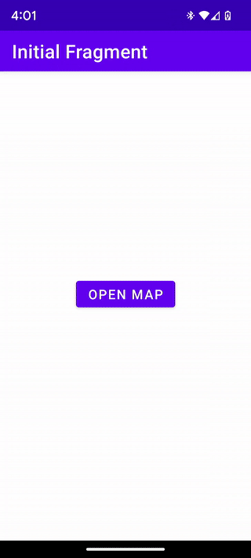

[](https://discord.gg/X8QB9DJXX6)


<!--
// TODO - enable when the repo gets released and is public

-->

[](https://github.com/openmobilehub/omh-maps/actions/workflows/publish_maps_api.yml)
[](https://github.com/openmobilehub/omh-maps/actions/workflows/publish_maps_api_gms.yml)
[](https://github.com/openmobilehub/omh-maps/actions/workflows/publish_maps_api_ngms.yml)

# OMH Maps Client Library

## Overview

OMH Maps Client Library is an Android SDK that simplifies the integration of maps on both Google Mobile Services (GMS) and non-GMS devices. It provides a unified interface and components for a consistent map experience, eliminating the need for separate codebases for different Android builds. This repository contains a detailed Getting Started guide to help developers learn and effectively implement the OMH Maps Client Library into their Android projects. For a general overview and understanding of the philosophy behind OMH, please visit the official website at https://www.openmobilehub.com.

## A single codebase, running seamlessly on any device

For instance, the following screenshots showcase multiple devices with Android, both with GMS and Non-GMS. The same app works without changing a single line of code, supporting multiple map provider implementations (Google Maps and OpenStreetMap).

<div align="center">

| Non-GMS Device</br>Kindle Fire HD 10 Kids      | Non-GMS Android Emulator Image</br>Pixel 6 Pro  | Non-GMS Device</br>Huawei P60                      | GMS Device</br>Pixel 6a                      |
| ---------------------------------------------- | ----------------------------------------------- | -------------------------------------------------- | -------------------------------------------- |
|  |  |  |  |

</div>

Packages:
// List and link oll the packages her

# Documentation
Getting started
Advanced docs
Api Reference docs

# Sample App

This repository includes a [maps-sample](/apps/maps-sample) that demonstrates the functionality of the OMH Maps Client Library. By cloning the repo and executing the app, you can explore the various features offered by the library.

However, if you prefer a step-by-step approach to learn the SDK from scratch, we recommend following the detailed Getting Started guide provided in this repository. The guide will walk you through the implementation process and help you integrate the OMH Maps Client Library into your projects effectively.

# Documentation

- Find complete documentation on the [Wiki](https://github.com/openmobilehub/omh-maps/wiki).
- Check out the [API Reference Docs](https://openmobilehub.github.io/omh-maps).

# Provider Implementations / Plugins

OMH Maps SDK is open-source, promoting community collaboration and plugin support from other map providers to enhance capabilities and expand supported map services. More details can be found at https://github.com/openmobilehub/omh-maps/wiki.
TODO: ADd link to create plugin section here

# Contributing

Please contribute! We will gladly review any pull requests. Make sure to read the [Contributing](https://github.com/openmobilehub/omh-maps/blob/release/1.0/CONTRIBUTING.md) page first though.

# License

```
Copyright 2023 Open Mobile Hub

Licensed under the Apache License, Version 2.0 (the "License");
you may not use this file except in compliance with the License.
You may obtain a copy of the License at

    https://www.apache.org/licenses/LICENSE-2.0

Unless required by applicable law or agreed to in writing, software
distributed under the License is distributed on an "AS IS" BASIS,
WITHOUT WARRANTIES OR CONDITIONS OF ANY KIND, either express or implied.
See the License for the specific language governing permissions and
limitations under the License.
```
