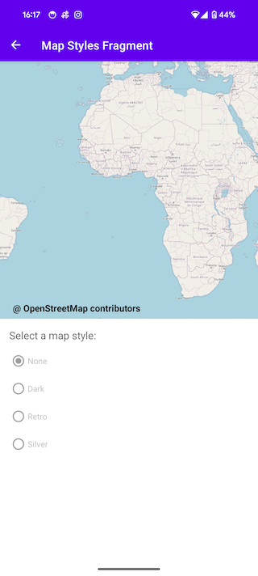

[](https://discord.gg/X8QB9DJXX6)


[](https://github.com/openmobilehub/android-omh-maps/actions/workflows/on_push_workflow.yml)
[](https://github.com/openmobilehub/android-omh-maps/actions/workflows/on_pull_request.yml)

[](https://github.com/openmobilehub/android-omh-maps/actions/workflows/publish_core.yml)
[](https://github.com/openmobilehub/android-omh-maps/actions/workflows/publish_plugin_googlemaps.yml)
[](https://github.com/openmobilehub/android-omh-maps/actions/workflows/publish_plugin_openstreetmap.yml)
[](https://github.com/openmobilehub/android-omh-maps/actions/workflows/publish_plugin_mapbox.yml)
[](https://github.com/openmobilehub/android-omh-maps/actions/workflows/publish_plugin_azuremaps.yml)

# OMH Maps Client Library

## Overview

OMH Maps Client Library is an Android SDK that simplifies the integration of maps on both Google Mobile Services (GMS) and non-GMS devices. It provides a unified interface and components for a consistent map experience, eliminating the need for separate codebases for different Android builds. This repository contains a detailed Getting Started guide to help developers learn and effectively implement the OMH Maps Client Library into their Android projects. For a general overview and understanding of the philosophy behind OMH, please visit the official website at https://www.openmobilehub.com.

### A single codebase, running seamlessly on any device

For instance, the following screenshots showcase multiple devices with Android, both with GMS and Non-GMS. The same app works without changing a single line of code, supporting multiple map provider implementations (Google Maps and OpenStreetMap).

<div align="center">

| Google Maps                    | Open Street Maps             | MapBox                          | Azure Maps                     |
| ------------------------------ | ---------------------------- | ------------------------------- | ------------------------------ |
| Camera Map                     |
|  |  |  |  |

</div>
<details>
  <summary>Show more</summary>

<div align="center">

| Google Maps                    | Open Street Maps             | MapBox                          | Azure Maps                     |
| ------------------------------ | ---------------------------- | ------------------------------- | ------------------------------ |
| Location Sharing Map           |
|  |  |  |  |
| Marker Map                     |
|  |  |  |  |
| Info Windows Map               |
|  |  |  |  |
| Polyline Map                   |
|  |  |  |  |
| Polygon Map                    |
|  |  |  |  |
| Custom Styles Map              |
|  |  |  |  |

</div>
</details>

## Getting Started

This section describes how to setup and use the OMH Maps SDK.

**Note: To quickly run a full-featured app with all OMH Maps functionality, refer to the [`Sample App`](#sample-app) section and follow the provided steps.**

### Download

OMH Maps Client Library is available on `mavenCentral()`

Add the plugins you want to use:

Azure Maps
```kotlin
implementation("com.openmobilehub.android.maps:plugin-azuremaps:2.0.0")
```

Google Maps
```kotlin
implementation("com.openmobilehub.android.maps:plugin-googlemaps:2.0.0")
```

Mapbox
```kotlin
implementation("com.openmobilehub.android.maps:plugin-mapbox:2.0.0")
```

Open Street Map
```kotlin
implementation("com.openmobilehub.android.maps:plugin-openstreetmap:2.0.0")
```

### Initial configuration

In your Application class configure initial plugin paths:

```kotlin
    class MainApplication : Application() {

        override fun onCreate() {
            super.onCreate()

        OmhMapProvider.Initiator()
            .addGmsPath("com.openmobilehub.android.maps.plugin.googlemaps.presentation.OmhMapFactoryImpl")
            .addNonGmsPath("com.openmobilehub.android.maps.plugin.mapbox.presentation.OmhMapFactoryImpl")
            .initialize()
        }
    }
```
You can find more detailed info here:
- [Setup with omh-core plugin](https://www.openmobilehub.com/android-omh-maps/advanced-docs/core/SETUP_WITH_OMH_CORE_PLUGIN/)
- [Setup without omh-core plugin](https://www.openmobilehub.com/android-omh-maps/advanced-docs/core/SETUP_WITHOUT_OMH_CORE_PLUGIN/)

### Provider specific setup

There are different setup requirements based on the provider you will be including into your app.
Please find the specific setup instruction for the providers below:

- [Google Maps](/packages/plugin-googlemaps/README.md)
- [OpenStreetMap](/packages/plugin-openstreetmap/README.md)
- [Mapbox](/packages/plugin-mapbox/README.md)
- [Azure Maps](/packages/plugin-azuremaps/README.md)

### Add the map into your app

The main interfaces that you will be interacting with are called `OmhMap`, `OmhMapView` and `OmhLocation`.
It contains all your basic maps and location functions like displaying a marker, map gestures, getting current location and more.
Additionally a fragment `OmhMapFragment` is provided, this fragment manages the life cycle of the map.

#### Add a Map fragment

`OmhMapFragment` is the simplest way to place a map in an application.
Fragment has to declare `android:name` that sets the class name of the fragment to `OmhMapFragment`, which is the fragment type used in the maps fragment file.

Insert the XML fragment snippet into your layout xml file.

   ```xml
   ...
       <fragment
           android:id="@+id/fragment_map_container"
           android:name="com.openmobilehub.android.maps.core.presentation.fragments.OmhMapFragment"
       />
   ...
   ```

## Sample App

This repository includes a [maps-sample](/apps/maps-sample) that demonstrates the functionality of the OMH Maps Client Library. By cloning the repo and executing the app, you can explore the various features offered by the library.

However, if you prefer a step-by-step approach to learn the SDK from scratch, we recommend following the detailed Getting Started guide provided in this repository. The guide will walk you through the implementation process and help you integrate the OMH Maps Client Library into your projects effectively.

## Provider Implementations / Plugins

OMH Maps SDK is open-source, promoting community collaboration and plugin support from other map providers to enhance capabilities and expand supported map services. More details can be found [here](./packages/core/docs/plugins/PLUGINS.md).

## Documentation

- Check out the [API Reference Docs](https://www.openmobilehub.com/android-omh-maps/api-docs/)
- Check out the [Core Package documentation](/packages/core/README.md)
- Check out the [Google Maps Plugin documentation](/packages/plugin-googlemaps/README.md)
- Check out the [OpenStreetMap Plugin documentation](/packages/plugin-openstreetmap/README.md)
- Check out the [Azure Maps Plugin documentation](/packages/plugin-azuremaps/README.md)

## Contributing

Please contribute! We will gladly review any pull requests. Make sure to read the [Contributing](/CONTRIBUTING.md) page first though.

## License

```
Copyright 2023 Open Mobile Hub

Licensed under the Apache License, Version 2.0 (the "License");
you may not use this file except in compliance with the License.
You may obtain a copy of the License at

    https://www.apache.org/licenses/LICENSE-2.0

Unless required by applicable law or agreed to in writing, software
distributed under the License is distributed on an "AS IS" BASIS,
WITHOUT WARRANTIES OR CONDITIONS OF ANY KIND, either express or implied.
See the License for the specific language governing permissions and
limitations under the License.
```
